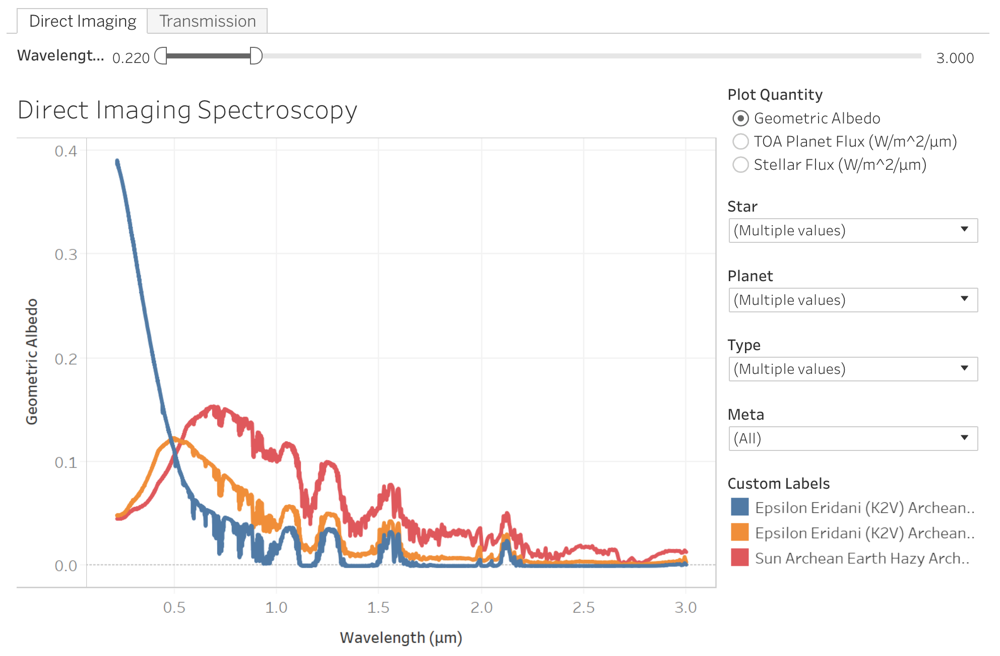

# VPL Spectral Database
Backend Python scripts for generating the VPL Spectral Database 

Use the [VPL Spectral Explorer](http://depts.washington.edu/naivpl/content/vpl-spectral-explorer) on the VPL website!

<noscript></noscript><object class='tableauViz'  style='display:none;'><param name='host_url' value='https%3A%2F%2Fpublic.tableau.com%2F' /> <param name='embed_code_version' value='3' /> <param name='site_root' value='' /><param name='name' value='VPLSpectralExplorerv3_2&#47;Dashboard1' /><param name='tabs' value='no' /><param name='toolbar' value='yes' /><param name='static_image' value='https:&#47;&#47;public.tableau.com&#47;static&#47;images&#47;VP&#47;VPLSpectralExplorerv3_2&#47;Dashboard1&#47;1.png' /> <param name='animate_transition' value='yes' /><param name='display_static_image' value='yes' /><param name='display_spinner' value='yes' /><param name='display_overlay' value='yes' /><param name='display_count' value='yes' /></object>
                
